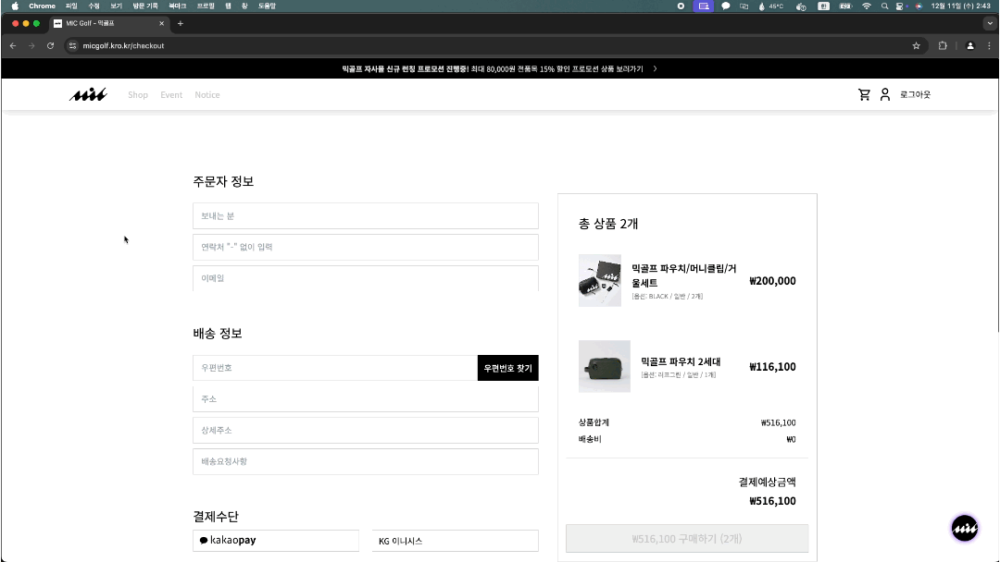
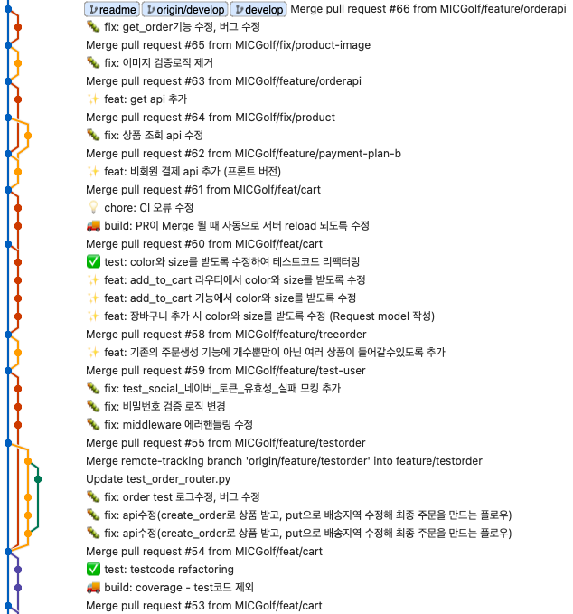
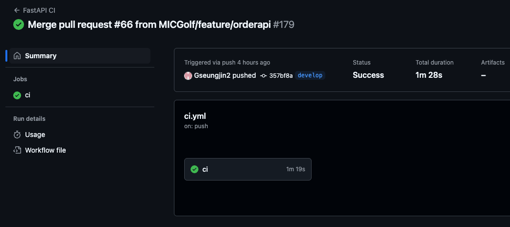

# Micgolf 쇼핑몰 서비스 - Backend

---


# 0. FastAPI 실행하기

---
- FastAPI 개발 서버 실행 명령어

> `$ gunicorn -w 4 -k uvicorn.workers.UvicornWorker src.main:app`

## 0-1. 랜딩페이지


## 0-2. 카카오 로그인


## 0-3. 상품조회, 장바구니


## 0-4. 결제



# 1. Project Overview (프로젝트 개요)

---
- 프로젝트 이름: Micgolf 쇼핑몰 제작 
- 프로젝트 설명: 골프 브랜드 '믹골프(Micgolf)' 홈페이지 신규 개발
<br/>
<br/>

# 2. Team Members (팀원 및 팀 소개)

---

|                                           안우진                                           |                                           강승진                                           |                                           김태우                                           |                                           정민준                                           |
|:---------------------------------------------------------------------------------------:|:---------------------------------------------------------------------------------------:|:---------------------------------------------------------------------------------------:|:---------------------------------------------------------------------------------------:|
|  |  |  |  |
|                                           BE                                            |                                           BE                                            |                                           BE                                            |                                           BE                                            |
|                         [GitHub](https://github.com/woojin-an)                          |                         [GitHub](https://github.com/Gseungjin2)                         |                         [GitHub](https://github.com/taewoo-dev)                         |                          [GitHub](https://github.com/jm-jung)                           |

# 3. Key Features (주요 기능)

---
- **회원가입**:
  - 자체 회원가입 및 소셜(Naver, Kakao) 로그인 구현

- **상품 관리**:
  - 상품 등록, 수정, 삭제, 조회 등

- **프로모션 관리**:
  - "Best Choice", "Md's pick" 등 프로모션 등록, 조회, 수정, 삭제 기능

- **배너, 카테고리 관리**:
  - 메인 페이지의 배너, 카테고리 관리 (등록, 수정, 삭제 기능)

- **장바구니 관리**:
  - (회원)장바구니 기능

- **주문 및 결제**:
  - 회원/비회원의 주문 및 결제 처리 기능

# 4. Tasks & Responsibilities (작업 및 역할 분담)

---
| 이름  | 역할 | 개발 작업                                                                              |
|:---:|:--:|:-----------------------------------------------------------------------------------|
| 안우진 | 팀장 | * 서버 구축 및 운용<br/> * 프로모션 기능 개발<br/> * 장바구니 기능 개발<br/>                              |
| 김태우 | 팀원 | * 커뮤니케이션 (기업 및 FE)<br/> * 회원가입 / 로그인 기능 개발<br/> * 결제 기능 개발<br/> * 상품 관리 기능 개발<br/> |
| 강승진 | 팀원 | * 배너 기능 개발<br/> * 결제 기능 개발<br/>                                                    |
| 정민준 | 팀원 | * 카테고리 기능 개발<br/> *주문 기능 개발<br/> *결제 기능 개발<br/>                                    |

# 5. Technology Stack (기술 스택)

---

## 5.1 백엔드 기술 스택

| **항목**        | **기술**                           | **설명**                                                     |
|---------------|:---------------------------------|------------------------------------------------------------|
| **프로그래밍 언어**  | Python                           | Python 기반의 애플리케이션 개발                                       |
| **웹 프레임워크**   | FastAPI                          | Python 기반의 현대적이고 빠른 웹 프레임워크                                |
| **데이터베이스**    | MySQL                            | DB for MySQL (NCP) 서비스를 이용하여 데이터베이스 실행 중                   |
| **ORM**       | Tortoise-ORM                     | Python ORM 라이브러리로, 데이터베이스 작업을 처리                           |
| **결제 시스템**    | PortOne(포트원)                     | 결제 처리 및 관련 서비스 연동                                          |
| **Redis**     | Redis                            | 데이터 캐싱 및 세션 관리용으로 사용                                       |
| **웹 서버**      | Apache2                          | FastAPI 애플리케이션을 배포하기 위한 웹 서버                               |
| **보안**        | SSL/TLS 인증서                      | HTTPS를 지원하기 위해 NCP 로드 밸런서에 SSL 인증서 등록                      |
| **배포 환경**     | Naver Cloud Platform (NCP)       | 서버 호스팅 및 운영                                                |
| **JWT 인증**    | JWT (Json Web Token)             | OAuth를 통해 인증된 사용자에게 JWT 토큰을 발급                             |
| **코드 품질 검사**  | * MyPy<br/> * isort<br/> * black | * Python 코드의 정적 타입 검사<br/> * import 정렬 확인<br/> * 코드 스타일 확인 |
| **테스트 프레임워크** | pytest                           | FastAPI 애플리케이션의 유닛 테스트와 통합 테스트를 실행                         |


## 5.2 NCP 이용 서비스
| **서비스 종류**    | **서비스 이름**     | **설명**                             |
|---------------|----------------|------------------------------------|
| **서버**        | Server (VPC)   | 가상 사설 클라우드 환경에서 서버 인스턴스를 생성 및 관리.  |
| **데이터베이스**    | DB for MySQL   | MySQL 기반의 데이터베이스 관리 서비스.           |
| **로드 밸런싱**    | Load Balancer  | 네트워크 트래픽을 여러 서버로 분산하여 고가용성을 제공.    |
| **스토리지**      | Block Storage  | 서버에 연결된 고속 저장 장치.                  |
| **DNS 관리**    | Global DNS     | 전 세계에 걸쳐 DNS 설정을 관리하고 고속 응답 제공.    |
| **네트워크**      | Network        | VPC, 서브넷, 방화벽 등 네트워크 리소스를 구성 및 관리. |
| **오브젝트 스토리지** | Object Storage | 대량의 비정형 데이터를 저장할 수 있는 스토리지 서비스.    |
| **공인 IP**     | Public IP      | 인터넷에서 접근 가능한 공인 IP 주소 제공.          |


# 6. 프로젝트 구조 

---
```
backend/
├── src/
│   ├── app/
│   │   ├── banner/
│   │   │   ├── dtos/
│   │   │   ├── models/
│   │   │   ├── services/
│   │   │   ├── __init__.py 
│   │   │   └── router.py
│   │   ├── cart/
│   │   ├── category/
│   │   ├── order/
│   │   ├── payment/
│   │   ├── product/
│   │   ├── promotion_product/
│   │   └── user/
│   ├── common/
│   │   ├── constants/
│   │   ├── exceptions/
│   │   ├── github_webhook/
│   │   ├── handlers/
│   │   ├── middlewares/
│   │   ├── models/
│   │   │   └── base_model.py
│   │   ├── utils/
│   │   ├── __init__.py
│   │   └── post_construct.py
│   ├── core/
│   │   ├── configs/         
│   │   │   ├── __init__.py
│   │   │   └── settings.py
│   │   ├── database/
│   │   │   ├── db_settings.py 
│   │   │   └── models.py      
│   │   └── __init__.py
│   ├── tests/
│   ├── .env                # 환경 변수 파일
│   ├── conftest.py
│   ├── main.py
│   ├── poetry.lock
│   ├── pyproject.toml
│   ├── start_gunicorn.sh       # 서버 실행 스크립트
│   └── test.sh
├── .gitignore
├── docker-compose.yml
├── docker-compose-mysql.yml
├── Dockerfile
└── README.md
```

# 7. 개발 워크플로우 (Development Workflow)

---

## 브랜치 전략 (Branch Strategy)
우리의 브랜치 전략은 Git Flow를 기반으로 하며, 다음과 같은 브랜치를 사용합니다:

- **develop 브랜치**
  - 배포 가능한 안정적인 코드를 유지합니다.
  - 모든 배포는 이 브랜치에서 이루어집니다.


- **Feature 브랜치**
  - 각 기능 개발을 위한 브랜치입니다.
  - feature/{기능명} 형식으로 브랜치를 생성합니다.
  - 기능 개발 완료 후 develop 브랜치로 병합합니다.

# 8. 커밋 컨벤션 (Commit Convention)

---

아래 Gitmoji 규칙을 참고하여 커밋 메세지 템플릿에 작성함
## 8.1 Gitmoji
 - ✨ feat: 새로운 기능 추가
 - 🐛 fix: 기능 수정, 버그 수정
 - 💡 chore: 오타 수정 및 새로운 기능이 추가되지 않고, 코드가 변경된 경우 (주석 추가 및 수정 포함)
 - 📝 docs: 문서 수정 (README 수정 시)
 - 🚚 build: 빌드 관련 파일 수정 및 삭제한 경우
 - ✅ test: 테스트 코드, 리팩터링 테스트 코드 추가 (프로덕션 코드 변경 X)
 - ♻️ refactor: 코드 리팩터링
 - 🚑 hotfix: 긴급 수정

## 8.2 커밋 메세지 템플릿
>  
> 제목 (필수)  
> 이모지 및 타입을 추가하여 50자 이내로 변경사항을 간단하게 요약하세요.  
> 예: ✨ feat: 새로운 로그인 기능 추가
> 
> 본문 (선택)  
> 변경한 이유를 상세하게 설명하세요. 여러 줄일 경우, 각 줄의 길이는 72자를 넘지 않게 작성하세요.  
> 예시:  
> - 이유 1  
> - 이유 2
> 
> Footer (선택)  
> 관련된 이슈 번호나 참고 정보를 추가하세요.  
> 예시: Resolves: 123
> 

## 8.3 컨벤션 수행 결과


# 9. Continuous Integration / Continuous Deployment (CI/CD)

---

## 9.1 GitHub Actions를 이용한 CI/CD 워크플로우

GitHub Actions를 사용하여 코드가 원격 저장소에 푸시될 때마다 CI/CD 파이프라인을 실행  
해당 workflow 는 코드 품질을 유지하고 애플리케이션의 안정성을 확보하기 위해 다양한 작업을 자동으로 수행


## 9.2 워크플로우 파일 위치
- `.github/workflows/fastapi-ci.yml`

## 9.3 CI/CD Detail
> ### 1. 트리거 조건
> - **Push 이벤트**: 코드가 저장소에 `push`될 때 자동 실행됩니다.
>
> ### 2. 실행 환경
> - **운영 체제**: Ubuntu 20.04
> - **Python 버전**: 3.12
>
> ### 3. 환경 변수
> - 데이터베이스 설정은 다음과 같은 환경 변수를 사용합니다:
>  - `DB_HOST`: 127.0.0.1
>  - `DB_PORT`: 3306
>  - `DB_USER`: root
>  - `DB_PASSWORD`: 1234
>  - `DB_DATABASE`: oz_fastapi
>
> ### 4. 주요 작업 단계
> 4.1. **코드 체크아웃**  
>   저장소의 코드를 가져옵니다.
>
> 
> 4.2. **Python 환경 설정**  
>   - Python 3.12 버전을 설정합니다.
>   - 한국 시간대(KST)로 변경합니다.
>
> 
> 4.3. **MySQL 데이터베이스 초기화**  
>   - MySQL 서버를 시작합니다.
>   - 지정된 데이터베이스 및 사용자 설정을 구성합니다.
>
> 
> 4.4. **의존성 설치**  
>   - Poetry를 설치하고 프로젝트의 의존성을 설정합니다.
>
> 
> 4.5. **코드 품질 검사**
>   - `black`: 코드 스타일 확인.
>   - `isort`: 임포트 정렬 확인.
>   - `mypy`: 정적 타입 검사.
>
> 
> 4.6. **테스트 실행**
>   - `pytest`: 테스트 실행 및 코드 커버리지 보고서 생성.


## 9.4 CI/CD 수행 결과

